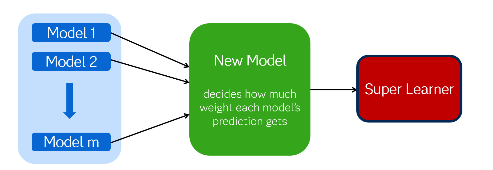

## 🔍 Causal Effect Estimation for Real World Evidence

This hands-on exercise uses SAS Viya to estimate the **average treatment effect (ATE)** of quitting smoking on ten-year weight change. We’ll leverage [`PROC SUPERLEARNER`](https://go.documentation.sas.com/doc/en/pgmsascdc/v_063/casstat/casstat_superlearner_overview.htm) and [`PROC CAEFFECT`](https://go.documentation.sas.com/doc/hi/pgmsascdc/v_063/casstat/casstat_caeffect_syntax01.htm) on observational data using ensemble learning and doubly robust estimation.


### Super Learner
The SUPERLEARNER procedure is available in the 2024.12 and later releases of SAS Visual Statistics and in the 2025.02 and later releases of SAS Viya Workbench. This procedure allows you to train super learner models for continuous or binary response variables. The procedure also allows you to train a cross-validated selector (discrete super learner), which chooses from the base learner library a single base learner that has the best performance in cross-validation instead of the default ensemble super learner, which creates a convex combination of the base[^1].

[^1]: [Super Learner for Predictive Modeling and Analytics](https://pharmasug.org/proceedings/2025/SA/PharmaSUG-2025-SA-171.pdf)  


---

### 💻 System Requirements

To run the causal effect estimation workflow described in this workshop, you must have access to:

- **SAS Viya version 2025.02 or later**


### 📁 Dataset: SmokingWeight

- Based on [NHANES Epideomiologic Followup Study](https://wwwn.cdc.gov/nchs/nhanes/nhefs/default.aspx)
- Outcome: `Change` (10-year weight change)
- Treatment: `Quit` (1 = quit smoking, 0 = continued)
- Covariates: `Age`, `Sex`, `Race`, `Education`, `Exercise`, `Activity`, `YearsSmoke`, `PerDay`

 For this example, it is assumed that the variables Activity, Age, BaseWeight, Education, Exercise, PerDay, Race, Sex, and YearsSmoke make up a valid adjustment set that you can use to obtain unbiased estimates of the potential outcome means.


Targeted maximum likelihood estimation (TMLE) is a doubly robust method that combines modeling of both the treatment and outcome variable to estimate the potential outcome means and causal effects. This example uses the super learner to model the treatment and outcome variables, because it has been proven effective when combined with TMLE for causal effect estimation.

---
### Step 1: Initiate a CAS session
```sas
cas;
caslib _ALL_ assign;
```

### Step 2: Load Data Into Memory

You can read sas7bdat, sashdat, parquet, or csv files directly into memory.

```sas

proc casutil outcaslib=casuser;
load  file = '/data/SMOKINGWEIGHT.csv'
casout='SmokingWeight';
quit;
```
This code will create an in memory table in the casuser caslib named Smokingweight (*NOTE: table names are not case sensitive but file names are*)

###  Step 3: Estimate Propensity Scores for *Smoking Cessation* 

We first estimate the probability of not quitting (`Quit = 0`) using Super Learner with a diverse set of base learners.

```sas
proc superlearner data=casuser.SmokingWeight seed=2324;
   target Quit / level=nominal;
   input Sex Race Education Exercise Activity / level=nominal;
   input Age YearsSmoke PerDay / level=interval;
   baselearner 'logistic' logselect;
   baselearner 'logistic_2way' logselect
      class=(Sex Race Education Exercise Activity)
      effect=(Age|YearsSmoke|PerDay|Sex|Race|Education|Exercise|Activity @ 2);
   baselearner 'logistic_ridge' logselect(selection=ELASTICNET(lambda=5 mixing=0))
      class=(Sex Race Education Exercise Activity)
      effect=(Age|YearsSmoke|PerDay|Sex|Race|Education|Exercise|Activity @ 2);
   baselearner 'gam' gammod;
   baselearner 'bart' bart(nTree=10 nMC=100);
   output out=casuser.swTrtEstData copyvars=(_ALL_);
run;
```


### Caluclate Propensity to Quit
```sas
data casuser.swTrtEstData;
  set casuser.swTrtEstData;
  P_Quit1 = 1 - P_Quit0;
run;
```
###  Step 4: Estimate Potential Outcomes (Continuse Response Variable) Using Super Learner

In this step, we estimate the potential weight change outcomes for individuals.
We include `Quit` as a predictor along with demographic and behavioral covariates to model the outcome variable `Change` (10-year weight difference).

```sas

proc superlearner data=casuser.swTrtEstData seed=2324;
   baselearner 'linear' regselect;
   baselearner 'linear_2way' regselect
      class=(Sex Race Education Exercise Activity Quit)
      effect=(Age|YearsSmoke|PerDay|Sex|Race|Education|Exercise|Activity|Quit @ 2);
   baselearner 'linear_ridge' regselect(selection=ELASTICNET(lambda=5 mixing=0))
      class=(Sex Race Education Exercise Activity Quit)
      effect=(Age|YearsSmoke|PerDay|Sex|Race|Education|Exercise|Activity|Quit @ 2);
   baselearner 'gam' gammod;
   baselearner 'bart' bart(nTree=10 nMC=100);
   margin 'quitsmoking' Quit=1;
   margin 'noquitsmoking' Quit=0;
   target Change / level=interval;
   input Sex Race Education Exercise Activity Quit / level=nominal;
   input Age YearsSmoke PerDay / level=interval;
   output out=casuser.swDREstData marginpred copyvars=(Quit Change P_Quit1 P_Quit0);
run;


```

###  Step 5: Estimate the Average Treatment Effect (ATE)

In this step, we estimate the **average treatment effect (ATE)** of quitting smoking on weight change by combining:

- The **propensity scores** estimated in Step 1
- The **predicted potential outcomes** from Step 2

We use `PROC CAEFFECT` to implement a doubly robust estimation framework, which provides valid inference if either the outcome model or the treatment model is correctly specified.

```sas

proc caeffect data=c.swDREstData inference method=TMLE;
   treatvar Quit;
   outcomevar Change;
   pom treatLev=1 treatProb=P_Quit1 predout=quitsmoking;
   pom treatLev=0 treatProb=P_Quit0 predout=noquitsmoking;
   difference evtLev=1;
run;
```
### Contact
- Samiul Haque (samiul.haque@sas.com)
### Acknowledgement
This exercise was desinged base on the work of 
- Honghe (Joe) Zhao (Joe.Zhao@sas.com)
- Clay Thompson
- Michael Lamm
