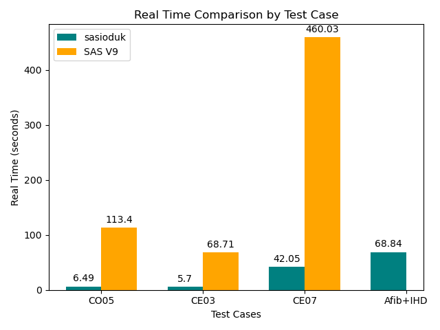
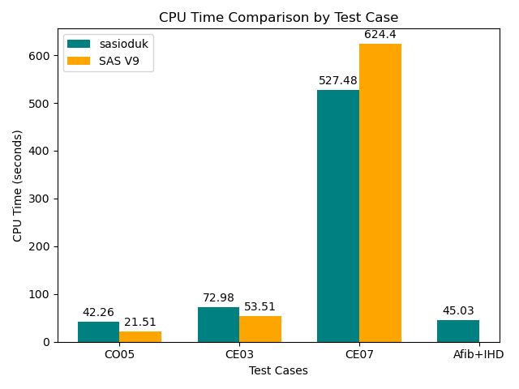

# Performance Comparison: SAS/ACCESS to DuckDB vs SAS V9 on OMOP SynPUF Data

## Overview

This report presents a performance and capability comparison between:

- **SAS/ACCESS Inteface to DuckDB (sasioduk)**: A SAS engine that integrates with **DuckDB**, enabling high-performance SQL on Parquet and other modern formats.
- **SAS V9**: Traditional SAS engine using `sas7bdat` files.

The test cases are based on **OMOP CDM** queries, including examples from the [OHDSI Query Library](https://data.ohdsi.org/QueryLibrary/) and a cohort from a [Nature Scientific Reports paper (2024)](https://doi.org/10.1038/s41598-024-52723-y).

## SAS/ACCESS Interface to DuckDB

SAS/ACCESS Interface to DuckDB is a new internal processing subsystem in the SAS Viya platform, planned to be available as an access engine that embeds DuckDB, a high-performance, in-process analytical database. Unlike traditional access engines that connect to external OLAP systems (e.g., Snowflake, Databricks, Redshift), this interface runs entirely within the SAS runtime and can efficiently query data stored across diverse sources—including file systems and cloud storage such as **AWS S3**, **Azure Blob Storage**, and **Google Cloud Storage**.

It supports open file formats like Parquet, Delta Lake, Avro, JSON, and Apache Iceberg, enabling flexible, high-performance analytics on modern data lakes. SAS/ACCESS to DuckDB allows seamless integration of SQL and data step logic, empowering SAS users to harness DuckDB’s speed and versatility without leaving the Viya environment or relying on external engines.

## Key Value Proposition

For many use cases—such as cohort building, which often involves complex temporal logic — SAS developers can use SAS/ACCESS to DuckDB to process large analytical workloads directly on cost-effective storage, bypassing the need for traditional data warehouse or lakehouse compute.

Importantly, SAS/ACCESS to DuckDB operates independently of CAS, helping reduce overall SAS Viya cloud costs while still delivering high-performance analytics.

## Performance

SAS/ACCESS to DuckDB can query parquet files directly which provides significant speed gain over sas7bdat ([Runtime Comparison](#real-time-(seconds))). Internal testing has shown that SAS/ACCESS to DuckDB also outperforms CAS.

## SynPUF OMOP Dataset Overview

The **CMS DE-SynPUF (Data Entrepreneurs' Synthetic Public Use File)** is a synthetic dataset derived from de-identified Medicare claims data. It contains data for approximately **2.33 million synthetic patients** and is structured to closely resemble real Medicare claims while ensuring patient privacy.

This dataset has been **transformed into the OMOP Common Data Model (CDM)** by the OHDSI community, making it a valuable resource for:

- **Testing and validating OHDSI tools**
- **Developing and benchmarking patient-level prediction models**
- **Training machine learning models on observational health data**
- **Demonstrating cohort definitions, treatment pathways, and outcome analyses**

It is widely used as a **public testbed** for observational research and analytics pipelines, especially in environments where access to real patient data is restricted.

Find the number of variables and observations across all the tables of these dataset in the following table.

| Member Name            | Number of Physical Observations | Number of Variables |
|------------------------|----------------------------------|----------------------|
| CARE_SITE              | 320,545                          | 6                    |
| CONCEPT                | 3,902,588                        | 10                   |
| CONCEPT_ANCESTOR       | 118,150,000                      | 4                    |
| CONCEPT_CLASS          | 300                              | 3                    |
| CONCEPT_RELATIONSHIP   | 26,727,250                       | 6                    |
| CONDITION_ERA          | 223,390,000                      | 6                    |
| CONDITION_OCCURRENCE   | 289,180,000                      | 13                   |
| DEATH                  | 107,644                          | 7                    |
| DEVICE_EXPOSURE        | 4,465,485                        | 14                   |
| DOMAIN                 | 39                               | 3                    |
| DRUG_ERA               | 125,870,000                      | 7                    |
| DRUG_EXPOSURE          | 126,050,000                      | 21                   |
| LOCATION               | 3,185                            | 8                    |
| MEASUREMENT            | 74,128,429                       | 16                   |
| OBSERVATION            | 37,531,051                       | 17                   |
| OBSERVATION_PERIOD     | 2,098,515                        | 7                    |
| PAYER_PLAN_PERIOD      | 7,789,512                        | 7                    |
| PERSON                 | 2,326,855                        | 18                   |
| PROVIDER               | 905,492                          | 13                   |
| RELATIONSHIP           | 410                              | 6                    |
| VISIT_OCCURRENCE       | 111,640,000                      | 12                   |
| VOCABULARY             | 42                               | 5                    |

## Size of the Test Data Set
|Parquet Files | SAS7bdat File| Compression Factor|
|--------------|--------------|-------------------|
|26 GB          | 90 GB       | **3.46x** reduction with Parquet| 
## Test Cases

| Test ID | Description | SQL Features | Engines Compared |
|---------|-------------|--------------|------------------|
| [**CO05**](CO05.sas) | Condition by gender/age (Nausea) | Joins, date math | SAS/ACCESS  DuckDB vs SAS V9 |
| [**CE03**](CE03.sas) | Condition duration by age/gender | Joins, grouping, date diff | SAS/ACCESS  DuckDB vs SAS V9 |
| [**CE07**](CE07.sas) | Comorbidities for diabetes | CTEs, joins, grouping | SAS/ACCESS  DuckDB vs SAS V9 |
| [**Afib+IHD**](Afib_IHD.sas) | Cohort generation for AFib with Ischemic Heart Disease | **Window functions**, CTEs | SAS/ACCESS to DuckDB only SAS PROC SQL does not support Window Function|

## Runtime Comparison

### Real Time (seconds)

| Test Case | SAS/ACCESS to DuckDB | SAS V9 |Speed Up Factor|
|-----------|----------|--------|---------------|
| [CO05](CO05.sas)      | 6.49     | 113.40 |**17.75** |
| [CE03](CE03.sas)      | 5.70     | 68.71  |**12.05** |
| [CE07](CE07.sas)       | 42.05    | 460.03  |**10.94** |
| [Afib+IHD](Afib_IHD.sas)  | 68.84    | N/A    | N/A |

### CPU Time (seconds)

| Test Case | SAS/ACCESS to DuckDB | SAS V9 |
|-----------|----------|--------|
| [CO05](CO05.sas)      | 42.26    | 21.51  |
| [CE03](CE03.sas)      | 72.98    | 53.51  |
| [CE07](CE07.sas)      | 527.48   | 624.40  |
| [Afib+IHD](Afib_IHD.sas)  | 45.03    | N/A    |

## Visual Comparison

### Real Time

### CPU Time

## Key Takeaways

- **SAS/ACCESS to DuckDB enables advanced SQL**: including CTEs and window functions not supported in SAS V9.
- **Performance is competitive**: SAS/ACCESS to DuckDB shows faster real-time execution in most cases, especially when reading from Parquet.
- **Modern data formats**: SAS/ACCESS to DuckDB supports Parquet natively, avoiding the need for conversion to `sas7bdat`.
- **Cohort creation**: Queries like Afib+IHD demonstrate the ability to handle complex cohort logic efficiently.

